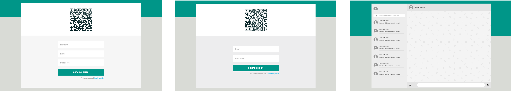
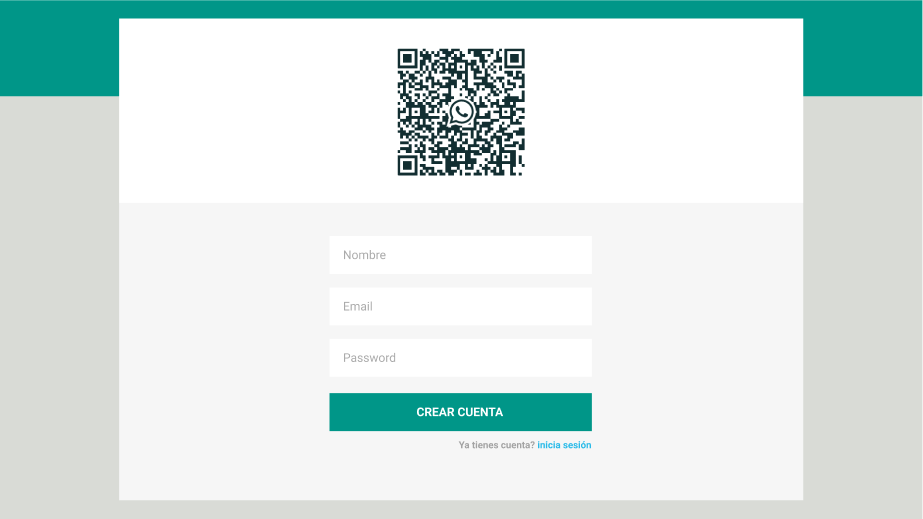

# Leta chat DOCUMENTACIÓN



### Cases de uso:

- [ ] crear cuenta
- [ ] iniciar sesión
- [ ] elegir chat
- [ ] enviar mensaje al chat actual
- [ ] buscar chat

### Base de datos:

Se usará **MongoDB** como base de datos, será necesario crear 2 colecciones: **usuarios** y **mensajes**.

**usuarios -** la colección de usuarios tendrá la siguiente estructura:

```js
  {
    name: String,
    email: String (unique),
    password: String,
    online: Boolean (defaul false),
  }
```

**mensajes -** la colección de mensajes tendrá la siguiente estructura:

```js
  {
    from: ObjectId,
    to: ObjectId,
    msg: String,
    createdAt: Date,
    updatedAt: Date,
  }
```

---

## Backend

El backend será desarrollado en Express.js

### routes:

el manejo de las rutas se hará en archivos independientes para mantener un orden.

Todo lo relacionado a la autenticación de usuarios se manejará en el archivo **authRouter.js**

---

##### crear cuenta

**POST** _referer/api/v1/auth/signup_ -> para crear una cuenta.

En el body se recibirá un objeto con los datos del usuario, así:

```js
  {
    name: 'Pepito Perez',
    email: 'pepito@correo.com',
    password: 'mipassword'
  }
```

---

##### iniciar sesión

**POST** _referer/api/v1/auth/login_ -> para iniciar sesión.

En el body se recibirá un objeto con las credenciales del usuario, así:

```js
  {
    email: 'pepito@correo.com',
    password: 'mipassword'
  }
```

---

Todo lo relacionado al chat (optener lista usuarios, obtener mensajes entre dos usuarios, etc) se manejará en el archivo **msgRouter.js**

---

##### obtener lista de usuarios

**GET** _referer/api/v1/chat/users_ -> para obtener todos los usuarios

En los headers se requerirá un jwt (x-auth-token) válido para devolver la información

---

##### obtener mensajes de un chat

**GET** _referer/api/v1/chat/messages_ -> para obtener los últimos 30 mensajes entre el usuario y el chat actual

Será necesario un jwt en los headers (x-auth-token) para devolver la información.

En el body se recibirá un objeto con los ObjectId de los usuarios implicados, así:

```js
  {
    from: ObjectId,
    to: ObjectId,
  }
```

---

##### guardar mensaje

**POST** _referer/api/v1/chat/new-msg_ -> para almacenar un nuevo mensaje

Será necesario un jwt en los headers (x-auth-token) para realizar la acción.

En el body se recibirá un objeto con la información del mensaje, así:

```js
  {
    from: ObjectId,
    to: ObjectId,
    msg: 'hola mundo'
  }
```

---

##### buscar chat

**GET** <referer/api/v1/chat/search?q=keyword> -> para buscar un chat

Será necesario un jwt en los headers (x-auth-token) para realizar la acción.

se retornarán todos los usuarios cuyo campo name contenga la keyword recibida

## Creando cuenta...



- Para crear una cuenta el usuario tendrá que ingresar su nombre, email y password.

- Con el fin de prevenir errores, el botón del formulario estará deshabilitado hasta que todos los inputs tengan información

- Se validarán los posibles errores enviados desde el backend, mostrando una alerta en función del error recibido.

-
