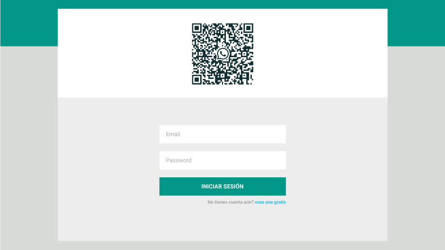

# Leta chat DOCUMENTACIÓN


### Casos de uso:

- [x] crear cuenta
- [x] iniciar sesión
- [ ] elegir chat
- [x] enviar mensaje al chat actual
- [x] buscar chat

### Base de datos:

Se usará **MongoDB** como base de datos, será necesario crear 2 colecciones: **usuarios** y **mensajes**.

**usuarios -** la colección de usuarios tendrá la siguiente estructura:

```js
  {
    name: String,
    email: String (unique),
    password: String,
    online: Boolean (defaul false),
  }
```

**mensajes -** la colección de mensajes tendrá la siguiente estructura:

```js
  {
    from: ObjectId,
    to: ObjectId,
    msg: String,
    createdAt: Date,
    updatedAt: Date,
  }
```

---

## Backend

El backend será desarrollado en Express.js

### routes:

el manejo de las rutas se hará en archivos independientes para mantener un orden.

Todo lo relacionado a la autenticación de usuarios se manejará en el archivo **authRouter.js**

---

##### crear cuenta

**POST** _referer/api/v1/auth/signup_ -> para crear una cuenta.

En el body se recibirá un objeto con los datos del usuario, así:

```js
  {
    name: 'Pepito Perez',
    email: 'pepito@correo.com',
    password: 'mipassword'
  }
```

se retornará un objeto con la siguiente información:

```js
  {
    ok: Boolean,
    token: jwt
    user: {
      id: ObjectId,
      name: String
    }
  }
```

---

##### iniciar sesión

**POST** _referer/api/v1/auth/login_ -> para iniciar sesión.

En el body se recibirá un objeto con las credenciales del usuario, así:

```js
  {
    email: 'pepito@correo.com',
    password: 'mipassword'
  }
```

se retornará un objeto con la siguiente información:

```js
  {
    ok: Boolean,
    token: jwt
    user: {
      id: ObjectId,
      name: String
    }
  }
```

---

Todo lo relacionado al chat (optener lista usuarios, obtener mensajes entre dos usuarios, etc) se manejará en el archivo **chatRouter.js**

---

##### obtener lista de usuarios

**GET** _referer/api/v1/chat/users_ -> para obtener todos los usuarios

En los headers se requerirá un jwt (x-auth-token) válido para devolver la información

---

##### obtener mensajes de un chat

**GET** _referer/api/v1/chat/messages_ -> para obtener los últimos 30 mensajes entre el usuario y el chat actual

Será necesario un jwt en los headers (x-auth-token) para devolver la información.

En el body se recibirá un objeto con los ObjectId de los usuarios implicados, así:

```js
  {
    from: ObjectId,
    to: ObjectId,
  }
```

---

##### guardar mensaje

**POST** _referer/api/v1/chat/new-msg_ -> para almacenar un nuevo mensaje

Será necesario un jwt en los headers (x-auth-token) para realizar la acción.

En el body se recibirá un objeto con la información del mensaje, así:

```js
  {
    from: ObjectId,
    to: ObjectId,
    msg: 'hola mundo'
  }
```

---

##### buscar chat

**GET** _referer/api/v1/chat/search?q=(keyword)_ -> para buscar un chat

Será necesario un jwt en los headers (x-auth-token) para realizar la acción.

se retornarán todos los usuarios cuyo campo name contenga la keyword recibida

## Frontend

Para el frontend se usará React.js

### Context

---

#### AuthContext.js

En el AuthContext se manejarán todos los estados relacionados a la autenticación del usuario. Como no se requieren muchos estados en esta parte, éstos se menajarán localmente con el useState hook.

**auth**

```js
const [auth, setAuth] = useState({
	fetching: true,
	logged: false,
	user: {},
});
```

---

#### ChatContext.js

En el ChatContext se manejarán todos los estados relacionados al chat en sí. En este caso se usará el useReducer hook para el manejo del estado global.

```js
const initialState = {
	users: [],
	messages: [],
	activeChat: ObjectId,
};
```

---

#### SocketContext.js

En el SocketContext se manejará directamente la escucha de eventos para disparar las acciones necesarias, y se compartirá la variable **socket** obtenida desde el useSocket que contiene la conexión con los sockets, de esta forma los componentes desde los cuales se necesité emitir un evento, podran hacerlo mediante dicha variable.

```js
const initialState = {
	users: [],
	messages: [],
};
```

---

## Custom Hooks

### useSocket

Desde este custom hook se manejará la conexión con el **socket server** mediante la librería _socket.io-client_

---

## Creando cuenta...


- Para crear una cuenta el usuario tendrá que ingresar su nombre, email y password.

- Con el fin de prevenir errores, el botón del formulario estará deshabilitado hasta que todos los inputs tengan información

- Se validarán los posibles errores enviados desde el backend, mostrando una alerta en función del error recibido.

- Si la acción es correcta, se guardará en el localstorage el jwt recibido y se actualizará el state del AuthContext, así:

```js
  {
    fetching: false,
    logged: true,
    user:{
      id: ObjectId,
      name: String
    }
  }
```

---

## Iniciando sesión...



- Para iniciar sesión, el usuario tendrá que ingresar su email y password.

- Con el fin de prevenir errores, el botón del formulario estará deshabilitado hasta que todos los inputs tengan información

- Se validarán los posibles errores enviados desde el backend, mostrando una alerta en función del error recibido.

- Si la acción es correcta, se guardará en el localstorage el jwt recibido y se actualizará el state del AuthContext, así:

```js
  {
    fetching: false,
    logged: true,
    user:{
      id: ObjectId,
      name: String
    }
  }
```

---

## Comunicación en tiempo real

Para manejar la comunicación en tiempo real entre clientes y servidor, se utilizará la librería **socket.io@4.2.0**
